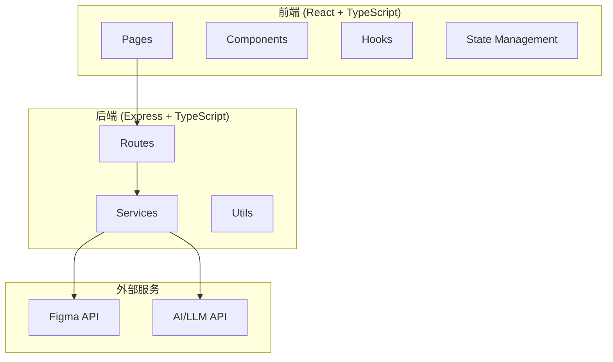
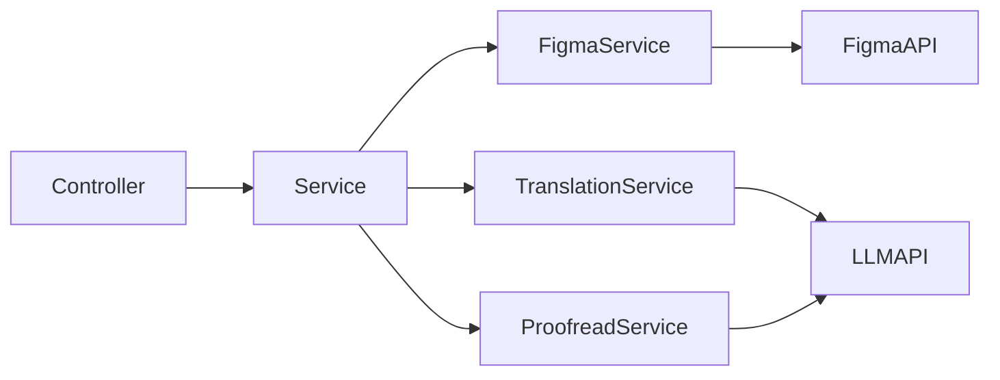

# Figma多语言工作流 - 技术架构文档

## 1. Architecture Design



## 2. Technology Description

- **Frontend**: React@18 + TypeScript + Vite + TailwindCSS + Zustand
- **Initialization Tool**: vite-init
- **Backend**: Express@4 + TypeScript
- **External APIs**: Figma REST API, LLM API

## 3. Route Definitions

| Route | Purpose |
|-------|---------|
| / | 首页 - Figma链接输入 |
| /preview | 文案预览页 |
| /brand-platform | 品牌平台选择 |
| /translation | 多语言翻译 |
| /proofread | AI校对 |

## 4. API Definitions

```typescript
// 共享类型定义
interface FigmaTextNode {
  id: string;
  name: string;
  characters: string;
  pageName: string;
  frameName?: string;
}

interface Brand {
  id: string;
  name: string;
  platforms: Platform[];
}

interface Platform {
  id: string;
  name: string;
  languages: string[];
}

interface TranslationResult {
  [key: string]: {
    [lang: string]: string;
  };
}

interface ProofreadResult {
  duplicates: DuplicateGroup[];
  qualityScores: QualityScore[];
  suggestions: Suggestion[];
}

// API 请求/响应
interface ExtractTextsRequest {
  figmaUrl: string;
  accessToken: string;
}

interface ExtractTextsResponse {
  success: boolean;
  nodes: FigmaTextNode[];
}

interface TranslateRequest {
  texts: string[];
  sourceLang: string;
  targetLangs: string[];
}

interface TranslateResponse {
  translations: TranslationResult;
}
```

## 5. Server Architecture Diagram



## 6. 核心模块说明

### 前端模块
- **FigmaUploader: Figma链接输入和文件处理
- **TextPreview: 文案列表展示和编辑
- **BrandPlatformSelector: 品牌平台选择
- **TranslationViewer: 翻译结果查看
- **ProofreadPanel: AI校对面板

### 后端模块
- **figma.ts**: Figma API 调用和文案提取
- **translation.ts**: AI 翻译服务
- **proofread.ts**: AI 校对服务
- **brands.ts**: 品牌和平台配置
